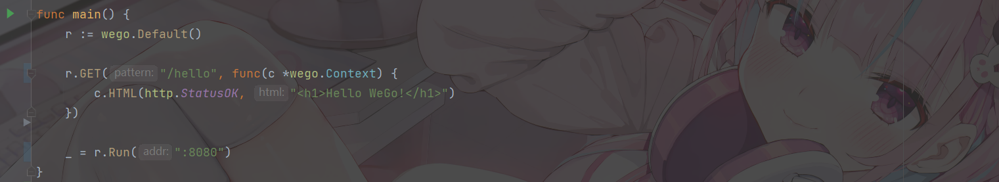

# WeGo



[](https://github.com/RichardLitt/standard-readme)

这是一个轻量级的使用Go语言编写的web框架,具有路由转发，分组控制，支持RESTful风格的API，并支持中间件拓展。

## 目录

- [背景](#背景)
- [安装](#安装)
- [快速入门](#快速入门)
- [代码示例](#代码示例)
  - [创建引擎实例](#创建引擎实例)
  - [运行引擎](#运行引擎)
  - [GET、POST](#GET、POST)
  - [获取路径中的参数](#获取路径中的参数)
  - [获取GET、POST参数](#获取GET、POST参数)
  - [路由分组](#路由分组)
  - [中间件](#中间件)

## 背景

这是作者在学习go语言时实现的一个轻量级web框架

## 安装

clone本项目到本地

## 快速入门

拷贝wego文件夹到项目目录下

在go.mod中编写
```
require (
	wego v0.0.0
)
replace (
	wego => ./wego
)
```
即可导入wego开始使用。

编写main.go

```go
package main

import (
	"net/http"
	"wego"
)

func main() {
	r := wego.Default()

	r.GET("/hello", func(c *wego.Context) {
		c.HTML(http.StatusOK, "<h1>Hello WeGo!</h1>")
	})

	_ = r.Run(":8080")
}
```

运行即可访问`localhost:8080/hello`

具体可以参考wego-web目录下的`main.go`

## 代码示例

### 创建引擎实例

使用

```go
e := wego.New()
```

来创建一个wego引擎实例。

也可以使用

```
e := wego.Default()
```

来创建一个使用了默认logger与recovery中间件的wego引擎实例

### 运行引擎

```
e.Run(":8080")
```

引擎将会运行在`localhost:8080`,也可自定义端口

### GET、POST

```go
r.GET("/hello", func(c *wego.Context) {
    c.HTML(http.StatusOK, "<h1>Hello WeGo!</h1>")
})
r.POST("/hello/:name", func(c *wego.Context) {
    c.String(http.StatusOK, "hello %s", c.Params["name"])
})
```

上面的例子展示了如何创建路由并定义处理函数

### 获取路径中的参数

在处理路径的函数中的上下文中可以获取路径中的参数

```go
r.GET("/hello/:name", func(c *wego.Context) {
    //使用c.Params[key]获取value
    c.String(http.StatusOK, "hello %s", c.Params["name"])
})
```

### 获取GET、POST参数

```go
//匹配的url：/hello?name=wego
r.GET("/hello", func(c *wego.Context) {
    //使用c.Query(key)获取GET参数
    c.String(http.StatusOK, "hello %s", c.Params["name"])
})

r.POST("/form_post", func(c *wego.Context) {
    //使用c.PostForm(key)获取表单中的value
    message := c.PostForm("message")

    c.JSON(http.StatusOK, wego.H{
        "status":  "posted",
        "message": message,
    })
})
```

实例展示了如何获取GET请求中的参数与POST请求中表单的参数

在POST请求中依然可以使用`c.Query(key)`来获取url中的参数（如果存在的话）。

### 路由分组

```go
// Simple group: v1
v1 := e.Group("/v1")
{
    // url: /v1/login
    v1.POST("/login", loginEndpoint)
    v1.POST("/submit", submitEndpoint)
    v1.POST("/read", readEndpoint)
}

// Simple group: v2
v2 := e.Group("/v2")
{
    v2.POST("/login", loginEndpoint)
    v2.POST("/submit", submitEndpoint)
    v2.POST("/read", readEndpoint)

    // Simple group: v3
    v3 := v2.Group("/v3")
    {
        // url: /v2/v3/login
        v3.POST("/login", loginEndpoint)
        v3.POST("/submit", submitEndpoint)
        v3.POST("/read", readEndpoint)
    }
}
```

在wego中，engine被抽象为一个根路由组，其他的路由分组为它的子路由组。

路由组可嵌套。

### 中间件

```go
// 创建一个不包含中间件的引擎
e := wego.New()

// 全局中间件
// 使用 Logger 中间件
e.Use(wego.Logger())

// 使用 Recovery 中间件
e.Use(wego.Recovery())
```

上面的例子与使用`e := wego.Default()`的效果完全相同


```go
	home := e.Group("、home")
	{
		home.Use(func(c *wego.Context) {
            //登录则放行
			if alreadyLogin {
				c.Next()
			}
            //未登录则返回错误
			c.Fail(http.StatusForbidden, "Permission denied")
		})
		home.GET("/hello", sayhello)
	}
```

上面的例子展示了如何为一个分组添加一个鉴权中间件

若你想要编写一个可复用中间件，可以使用以下方法

```go
func CheckLogin() wego.HandlerFunc {
	return func(c *wego.Context) {
		if alreadyLogin {
			c.Next()
		}
		c.Fail(http.StatusForbidden, "Permission denied")
	}
}

home := e.Group("home")
{
    home.Use(CheckLogin())
    home.GET("/hello", sayhello)
}
```

